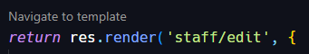

# Template-lens extension

A simple extension to use at work and make it easy to navigate inside templates. Everytime a javascript file is opened we will check for a `res.render(` line and show a clickable command above that line. Clicking it, will open the referrenced template in a new vscode file tab.



### Notes
- only works with expressjs templates
- needs some config (check how to config below)

### Configuration

```json
{
  "template-lens": {
    "templatePath": "workspace/template/path/", // main src dir for your templates
    "fileExtension": ".html", // if not set will use .html as default
  }
}
```